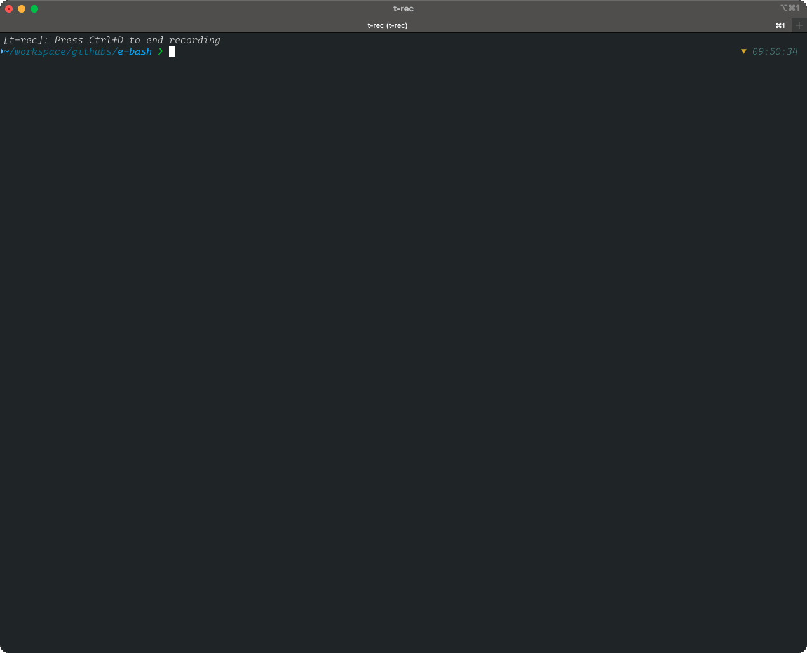
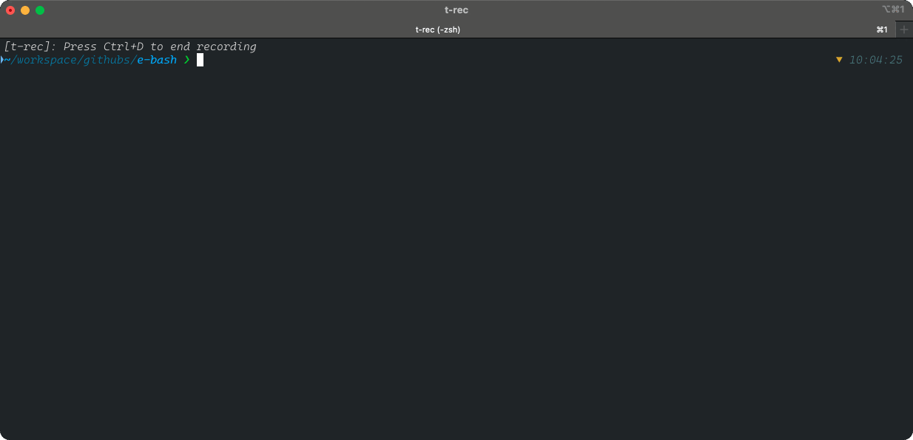
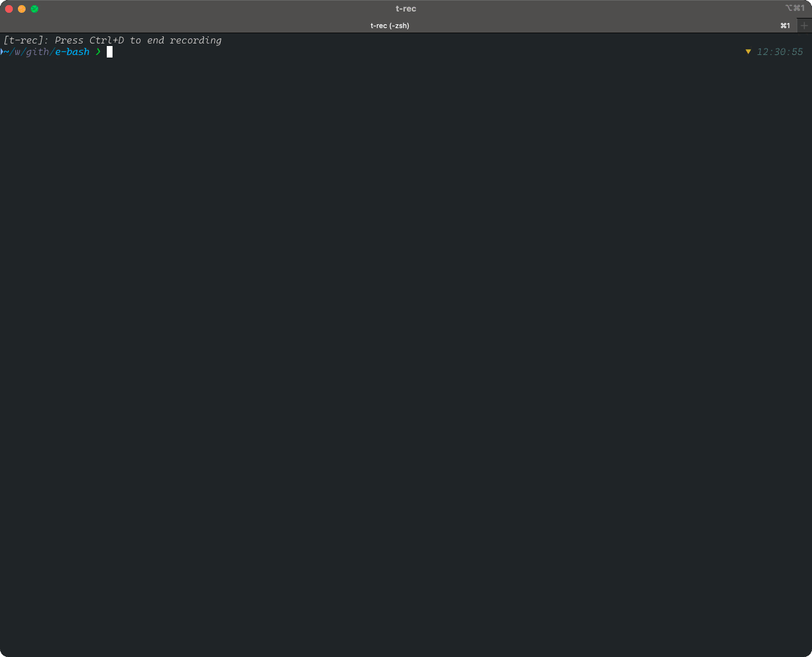

[](https://deepwiki.com/OleksandrKucherenko/e-bash) 

# Enhanced BASH Scripts

- [Enhanced BASH Scripts](#enhanced-bash-scripts)
  - [Roadmap](#roadmap)
  - [Local Dev Environment - Requirements](#local-dev-environment---requirements)
  - [TDD - Test Driven Development, run tests on file change](#tdd---test-driven-development-run-tests-on-file-change)
  - [Usage](#usage)
    - [Colors](#colors)
    - [Script Dependencies](#script-dependencies)
    - [Logger](#logger)
    - [Arguments Parsing](#arguments-parsing)
    - [Common(s) Functions And Inputs](#commons-functions-and-inputs)
    - [UI: Selector](#ui-selector)
    - [UI: Ask for Password](#ui-ask-for-password)
  - [Semver - Semantic Versioning](#semver---semantic-versioning)
  - [Self-Update](#self-update)
    - [Troubleshooting](#troubleshooting)
  - [Profile BASH script execution](#profile-bash-script-execution)
  - [Colors support in my terminal](#colors-support-in-my-terminal)
  - [References](#references)

## Roadmap

- [ ] High-level scripts should be in their own `bin` OR `scripts`
- [ ] Git helpers
- [ ] GitLab's helper scripts (work with branches, forks, submodules)
- [ ] Slack notifications helper scripts
- [ ] Telemetry module (report metrics to CI or DataDog)
- [ ] Globals module (declarative way of defining script dependencies to global environment variables)
- [ ] Logs monitoring documentation (different streams/files/tty for different information: info, debug, telemetry, dependencies)
- [ ] Copyright headers composing/parsing (extract from the file, update, insert)

## Local Dev Environment - Requirements

- DirEnv - https://github.com/direnv/direnv
- ShellFormat - https://github.com/mvdan/sh
- ShellCheck - https://github.com/koalaman/shellcheck
- KCov - https://github.com/SimonKagstrom/kcov
- ShellSpec - https://github.com/shellspec/shellspec

> Note: alternative Unit Test Frameworks, Bats - https://github.com/bats-core/bats-core

```bash
brew install direnv
brew install shellcheck
brew install shfmt
brew install shellspec
brew install kcov
```

## TDD - Test Driven Development, run tests on file change

```bash
# make tool required Python in hidden dependencies
# ref1: https://docs.astral.sh/uv/guides/install-python/
# ref2: https://github.com/astral-sh/uv
uv python install 
# alternative: pyenv install 3.13.2 && pyenv global 3.13.2

# run all unit tests on file change
watchman-make -p 'spec/*_spec.sh' '.scripts/*.sh' --run "shellspec"

# run failed only unit tests on file change
watchman-make -p 'spec/*_spec.sh' '.scripts/*.sh' --run "shellspec --quick"

# run failed only unit tests on file change without coverage
watchman-make -p 'spec/*_spec.sh' '.scripts/*.sh' --run "shellspec --quick --no-kcov --"
```

## Usage

Installation into your project with helper script:

> install/upgrade to the latest version

```bash
curl -sSL https://git.new/e-bash | bash -s --
```

Alternatives:

```bash
# OR: install latest version
wget -qO- https://git.new/e-bash | bash -s -- install
# OR: install latest version (httpie)
http -b https://git.new/e-bash | bash -s -- install

# install specific version
curl -sSL https://git.new/e-bash | bash -s -- install v1.0.0
# OR: install specific version
wget -qO- https://git.new/e-bash | bash -s -- install v1.0.0
# OR: install specific version (httpie)
http -b https://git.new/e-bash | bash -s -- install v1.0.0
```

[More details](./docs/installation.md)

### Manual installation

```bash
git remote add -f e-bash https://github.com/OleksandrKucherenko/e-bash.git  
git checkout -b e-bash-temp e-bash/master  
git subtree split -P .scripts -b e-bash-scripts  
git checkout master # or main - depends on your main branch in repo
git subtree merge --prefix .scripts e-bash-scripts --squash
```

Upgrade `.scripts` to the latest version:

```bash
git fetch e-bash master  
git checkout e-bash-temp && git reset --hard e-bash/master  
git subtree split -P .scripts -b e-bash-scripts  
git checkout <your-main-branch>  
git subtree pull --prefix .scripts e-bash-scripts --squash
```

refs:

- https://gist.github.com/SKempin/b7857a6ff6bddb05717cc17a44091202
- https://github.com/epcim/git-cross
- https://github.com/ingydotnet/git-subrepo
- https://gist.github.com/icheko/9ff2a0a90ef2b676a5fc8d76f69db1d3 [article](https://medium.com/@icheko/use-a-subfolder-from-a-remote-repo-in-another-repo-using-git-subtree-98046f33ca40)

### Colors

```bash
source ".scripts/_colors.sh"

echo -e "${cl_red}Hello World${cl_reset}"
```

### Script Dependencies



```bash
source ".scripts/_dependencies.sh"

dependency bash "5.*.*" "brew install bash"
dependency direnv "2.*.*" "curl -sfL https://direnv.net/install.sh | bash"
dependency shellspec "0.28.*" "brew install shellspec"
optional kcov "42" "brew install kcov"
dependency shellcheck "0.9.*" "curl -sS https://webi.sh/shellcheck | sh"
dependency shfmt "3.*.*" "curl -sS https://webi.sh/shfmt | sh"
dependency watchman "2023.07.*.*" "brew install watchman"

# different return codes for success and failure
dependency watchman "2023.07.*.*" "brew install watchman" && echo "OK!" || echo "FAIL!"

# optional always return success
optional watchman "2023.07.*.*" "brew install watchman" && echo "OK!" || echo "never happens!"

# Allow of HEAD or stable versions of the watchman tool
wHead=$(dependency watchman "HEAD-[a-f0-9]{1,8}" "brew install watchman")
wStab=$(dependency watchman "2024.*.*.*" "brew install watchman")
echo "$wHead" | grep 'Error' &>/dev/null && echo "$wStab" || echo "$wHead"
```

### Logger

Requirements:
- [x] zero dependencies, pure BASH (optional: _colors.sh)
- [x] prefix for all logger messages
- [x] work in pipe mode (forward logs to the named pipe)
  - [x] write logs to pipe; single line or multiple lines in '|' pipe mode
  - [x] read logs from the named pipe and output to the console (or file).
  - [x] redirect logs to file/stream/pipe/tty 
- [x] support prefix for each log message
- [x] listen to DEBUG environment variable for enabling/disabling logs
  - [x] enable/disable log by tag name or tag name prefix (support wildcards)
- [*] execute command with logging the command and it parameters first (ref: https://bpkg.sh/pkg/echo-eval)
  - [x] can be easily self-made (ref: https://github.com/kj4ezj/echo-eval/blob/main/ee.sh)

```bash
source ".scripts/_logger.sh"
logger common "$@" # declare echo:Common and printf:Common functions, tag: common
logger debug "$@" # declare echo:Debug and printf:Debug functions, tag: debug

echo:Common "Hello World" # output "Hello World" only if tag common is enabled

export DEBUG=*          # enable logger output for all tags
export DEBUG=common     # enable logger output for common tag only
export DEBUG=*,-common  # enable logger output for all tags except common

# advanced functions
config:logger:Common "$@" # re-configure logger enable/disable for common tag

# echo in pipe mode
find . -type d -max-depth 1 | log:Common

# echo in output redirect
find . -type d -max-depth 1 >log:Common

# more samples of usage are in `demos/demo.logs.sh` file
```

Complete demo: [Logger Demo](demos/demo.logs.sh)

### Arguments Parsing

Requirements:

- [x] zero dependencies, pure BASH
- [x] support short and long arguments
- [x] support default values
- [x] support required arguments
- [x] support aliases for arguments
- [x] support destination variables for argument
- [x] compose help documentation from arguments definition

```bash
# pattern: "{argument_index},-{short},--{alias}={output_variable}:{default_initialize_value}:{reserved_args_quantity}"
# example: "-h,--help=args_help:true:0", on --help or -h set $args_help variable to true, expect no arguments;
# example: "$1,--id=args_id::1", expect first unnamed argument to be assigned to $args_id variable; can be also provided as --id=123
export ARGS_DEFINITION="-h,--help -v,--version=:1.0.0"
export ARGS_DEFINITION+=" --debug=DEBUG:*"

# will automatically parse script arguments with definition from $ARGS_DEFINITION global variable
source "$E_BASH/_arguments.sh"

# check variables that are extracted
echo "Is --help: $help"
echo "Is --version: $version"
echo "Is --debug: $DEBUG"

# advanced run. parse provided arguments with definition from $ARGS_DEFINITION global variable
parse:arguments "$@"
```

More details: [Arguments Parsing](docs/arguments.md), [Demo script](demos/demo.args.sh).

### Common(s) Functions And Inputs

```bash
source ".scripts/_commons.sh"

# Extract parameter from global env variable OR from secret file (file content)
env:variable:or:secret:file "new_value" \
  "GITLAB_CI_INTEGRATION_TEST" \
  ".secrets/gitlab_ci_integration_test" \
  "{user friendly message}"

echo "Extracted: ${new_value}"
```

### UI: Selector


```bash
source ".scripts/_commons.sh"

# Select value from short list of choices
declare -A -g connections && connections=(["d"]="production" ["s"]="cors-proxy:staging" ["p"]="cors-proxy:local")
echo -n "Select connection type: " && tput civis # hide cursor
selected=$(input:selector "connections") && echo "${cl_blue}${selected}${cl_reset}"
```

### UI: Ask for Password


```bash
source ".scripts/_commons.sh"

# Usage:
echo -n "Enter password: "
password=$(input:readpwd) && echo "" && echo "Password: $password"
```

## Semver - Semantic Versioning

Requirements:

- [x] parse version code, according to semver specification
- [x] compare version code
- [x] verify version constraints
- [x] compose version code from array of segments

```bash
source ".scripts/_semver.sh"

# verify that version is passing the constraints expression
semver:constraints "1.0.0-alpha" ">1.0.0-beta || <1.0.0" && echo "$? - OK!" || echo "$? - FAIL!" # expected OK

# more specific cases
semver:constraints:simple "1.0.0-beta.10 != 1.0.0-beta.2" && echo "OK!" || echo "$? - FAIL!"

# parse and recompose version code
semver:parse "2.0.0-rc.1+build.123" "V" \
  && for i in "${!V[@]}"; do echo "$i: ${V[$i]}"; done \
  && semver:recompose "V"

# test version code
echo "1" | grep -E "${SEMVER_LINE}" --color=always --ignore-case || echo "OK!"
```

## Self-Update

Requirements:

- [x] detect a new version of the script
- [x] download multiple versions into folder and do a symbolic link to a specific version
- [x] download from GIT repo (git clone)
  - [x] keep MASTER as default, extract version tags as sub-folders
- [ ] download from GIT repo release URL (tar/zip archive)
  - [ ] extract archive to a version sub-folder
- [x] rollback to previous version (or specified one)
  - [x] rollback to latest backup file (if exists)
- [ ] partial update of the scripts, different versions of scripts from different version sub-folders
  - [x] developer can bind file to a specific version by calling function `self-update:version:bind`
- [x] verify SHA1 hash of the scripts
  - [x] compute file SHA1 hash and store it in \*.sha1 file
- [x] understand version expressions
  - [ ] `latest` - latest stable version
  - [ ] `*` or `next` - any highest version tag (INCLUDING: alpha, beta, rc etc)
  - [ ] `branch:{any_branch}` or `tag:{any_tag}` - any branch name (also works for TAGs)
  - [x] `>`, `<`, `>=`, `<=`, `~`, `!=`, `||` - comparison syntax
  - [x] `1.0.0` or `=1.0.0` - exact version
  - [x] `~1.0.0` - version in range >= 1.0.x, patch releases allowed
  - [x] `^1.0.0` - version in range >= 1.x.x, minor & patch releases allowed
  - [x] `>1.0.0 <=1.5.0` - version in range `> 1.0.0 && <= 1.5.0`
  - [x] `>1.0.0 <1.1.0 || >1.5.0` - version in range `(> 1.0.0 < 1.1.0) || (> 1.5.0)`

refs:

- https://classic.yarnpkg.com/lang/en/docs/dependency-versions/
- https://github.com/fsaintjacques/semver-tool
- https://github.com/Masterminds/semver
- https://stackoverflow.com/questions/356100/how-to-wait-in-bash-for-several-subprocesses-to-finish-and-return-exit-code-0


```bash
source ".scripts/_self-update.sh"

# check for version update in range >= 1.0.x, stable versions
# try to update itself from https://github.com/OleksandrKucherenko/e-bash.git repository
self-update "~1.0.0"                          # patch releases allowed
self-update "^1.0.0"                          # minor releases allowed
self-update "> 1.0.0 <= 1.5.0"                # stay in range

# update specific file to latest version tag
self-update "latest" ".scripts/_colors.sh"    # latest stable
self-update "*" ".scripts/_colors.sh"         # any highest version tag

# update specific file to MASTER version (can be used any branch name)
self-update "branch:master" ".scripts/_colors.sh"
self-update "tag:v1.0.0" ".scripts/_colors.sh"

# bind file to a specific version
self-update:version:bind "v1.0.0" ".scripts/_colors.sh"

# TBD

# INTEGRATION EXAMPLE

# do self-update on script exit
trap "self-update '^1.0.0'" EXIT

# OR:
function __exit() {
  # TODO: add more cleanup logic here
  self-update '^1.0.0'
}
trap "__exit" EXIT
```

### Troubleshooting

```bash
# rollback with use of backup file(s)
source ".scripts/_self-update.sh" && self-update:rollback:backup "${full_path_to_file}"

# rollback to specific version
source ".scripts/_self-update.sh" && self-update:rollback:version "v1.0.0" "${full_path_to_file}"
```

## Profile BASH script execution



```bash
# print timestamp for each line of executed script
PS4='+ $(gdate "+%s.%N ($LINENO) ")' bash -x bin/version-up.sh

# save trace to file
PS4='+ $(echo -n "$EPOCHREALTIME [$LINENO]: ")' bash -x bin/version-up.sh 2>trace.log

# process output to more user-friendly format: `execution_time | line_number | line_content`
PS4='+ $(echo -n "$EPOCHREALTIME [$LINENO]: ")' bash -x bin/version-up.sh 2>trace.log 1>/dev/null && cat trace.log | bin/profiler/tracing.sh

# profile script execution and print summary
bin/profiler/profile.sh bin/version-up.sh
```

- ref1: https://itecnote.com/tecnote/r-performance-profiling-tools-for-shell-scripts/
- ref2: https://www.thegeekstuff.com/2008/09/bash-shell-take-control-of-ps1-ps2-ps3-ps4-and-prompt_command/

## Colors support in my terminal



```bash
# print all colors for easier selection
demos/demo.colors.sh
```

## References

- PV - https://manpages.ubuntu.com/manpages/focal/man1/pv.1.html
- https://catern.com/posts/pipes.html
- https://stackoverflow.com/questions/238073/how-to-add-a-progress-bar-to-a-shell-script
- [bash-core](https://github.com/bash-bastion/bash-core/blob/main/pkg/src/util/util.sh#L17-L38), trap enhancement
- [bash-bastion](https://github.com/bash-bastion) BASH helpers
- https://github.com/dylanaraps/writing-a-tui-in-bash
