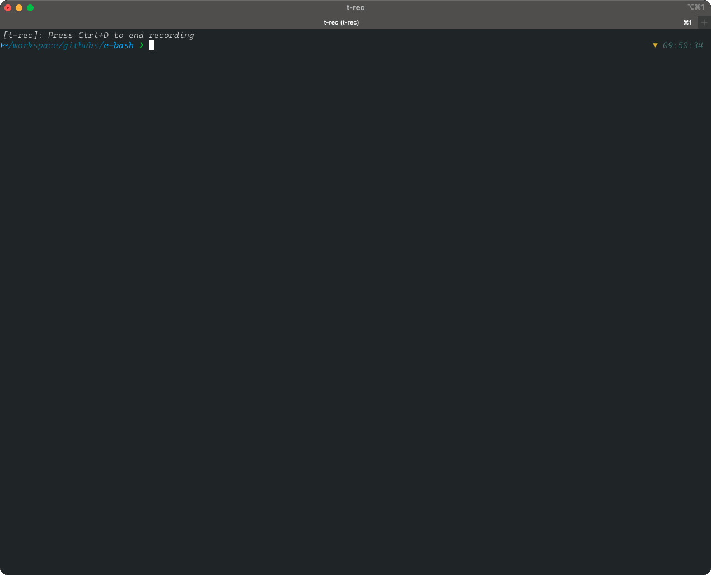
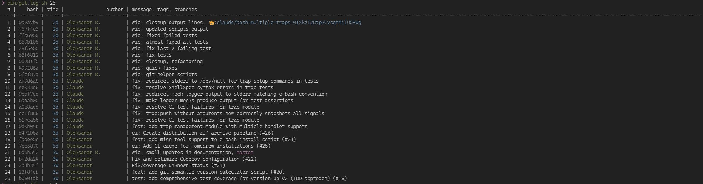
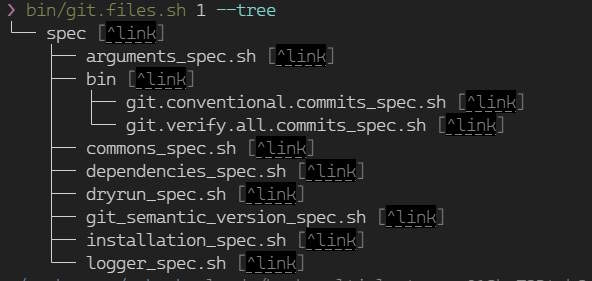

[](https://deepwiki.com/OleksandrKucherenko/e-bash) [](https://codecov.io/gh/OleksandrKucherenko/e-bash)

# Enhanced BASH Scripts

[](https://smithery.ai/skills?ns=oleksandrkucherenko&utm_source=github&utm_medium=badge)


- [Enhanced BASH Scripts](#enhanced-bash-scripts)
  - [Roadmap](#roadmap)
  - [Local Dev Environment - Requirements](#local-dev-environment---requirements)
  - [TDD - Test Driven Development, run tests on file change](#tdd---test-driven-development-run-tests-on-file-change)
  - [Usage](#usage)
    - [Manual installation](#manual-installation)
    - [Colors](#colors)
    - [Script Dependencies](#script-dependencies)
    - [Logger](#logger)
    - [Arguments Parsing](#arguments-parsing)
    - [Common(s) Functions And Inputs](#commons-functions-and-inputs)
    - [UI: Selector](#ui-selector)
    - [UI: Ask for Password](#ui-ask-for-password)
    - [Dry-Run Wrapper System](#dry-run-wrapper-system)
    - [Hooks](#hooks)
  - [Semver - Semantic Versioning](#semver---semantic-versioning)
  - [Git Semantic/Conventional commits](#git-semanticconventional-commits)
  - [Git Verify Commits Messages - Conventional Commits](#git-verify-commits-messages---conventional-commits)
  - [Git Logs](#git-logs)
  - [Git Files Changes](#git-files-changes)
  - [Self-Update](#self-update)
    - [Troubleshooting](#troubleshooting)
  - [Profile BASH script execution](#profile-bash-script-execution)
  - [Colors support in my terminal](#colors-support-in-my-terminal)
  - [Emoji support in my terminal](#emoji-support-in-my-terminal)
  - [References](#references)

## Roadmap

- [ ] High-level scripts should be in their own `bin` OR `scripts`
- [ ] Git helpers
- [ ] GitLab's helper scripts (work with branches, forks, submodules)
- [ ] Slack notifications helper scripts
- [ ] Telemetry module (report metrics to CI or DataDog)
- [ ] Globals module (declarative way of defining script dependencies to global environment variables)
- [x] Logs monitoring documentation (different streams/files/tty for different information: info, debug, telemetry, dependencies)
- [x] Copyright headers composing/parsing (extract from the file, update, insert)

Conventions and folder structure: [docs/public/conventions.md](docs/public/conventions.md)

## Local Dev Environment - Requirements

- [DirEnv](https://github.com/direnv/direnv)
- [ShellFormat](https://github.com/mvdan/sh)
- [ShellCheck](https://github.com/koalaman/shellcheck)
- [KCov](https://github.com/SimonKagstrom/kcov)
- [ShellSpec](https://github.com/shellspec/shellspec)

> Note: alternative Unit Test Frameworks, Bats - [BATS core](https://github.com/bats-core/bats-core)

```bash
brew install direnv
brew install shellcheck
brew install shfmt
brew install shellspec
brew install kcov
```

## TDD - Test Driven Development, run tests on file change

```bash
# make tool required Python in hidden dependencies
# ref1: https://docs.astral.sh/uv/guides/install-python/
# ref2: https://github.com/astral-sh/uv
uv python install 
# alternative: pyenv install 3.13.2 && pyenv global 3.13.2

# run all unit tests on file change
watchman-make -p 'spec/*_spec.sh' '.scripts/*.sh' --run "shellspec"

# run failed only unit tests on file change
watchman-make -p 'spec/*_spec.sh' '.scripts/*.sh' --run "shellspec --quick"

# run failed only unit tests on file change without coverage
watchman-make -p 'spec/*_spec.sh' '.scripts/*.sh' --run "shellspec --quick --no-kcov --"

# Multiple Jobs (parallel execution)
# shellspec -j 8  
# 40.34s user 10.62s system 38% cpu 2:12.97 total
# shellspec -j 4  
# 40.35s user 10.28s system 40% cpu 2:03.77 total
```

## Usage

Installation into your project with helper script:

> install/upgrade to the latest version

```bash
curl -sSL https://git.new/e-bash | bash -s --
```

Alternatives:

```bash
# OR: install latest version
wget -qO- https://git.new/e-bash | bash -s -- install
# OR: install latest version (httpie)
http -b https://git.new/e-bash | bash -s -- install

# install specific version
curl -sSL https://git.new/e-bash | bash -s -- install v1.0.0
# OR: install specific version
wget -qO- https://git.new/e-bash | bash -s -- install v1.0.0
# OR: install specific version (httpie)
http -b https://git.new/e-bash | bash -s -- install v1.0.0
```

[More details](./docs/public/installation.md)

### Manual installation

```bash
git remote add -f e-bash https://github.com/OleksandrKucherenko/e-bash.git  
git checkout -b e-bash-temp e-bash/master  
git subtree split -P .scripts -b e-bash-scripts  
git checkout master # or main - depends on your main branch in repo
git subtree merge --prefix .scripts e-bash-scripts --squash
```

Upgrade `.scripts` to the latest version:

```bash
git fetch e-bash master  
git checkout e-bash-temp && git reset --hard e-bash/master  
git subtree split -P .scripts -b e-bash-scripts  
git checkout <your-main-branch>  
git subtree pull --prefix .scripts e-bash-scripts --squash
```

refs:

- [Git Subtree Basics](https://gist.github.com/SKempin/b7857a6ff6bddb05717cc17a44091202)
- [git-cross](https://github.com/epcim/git-cross)
- [git-subrepo](https://github.com/ingydotnet/git-subrepo)
- [github repo for article](https://gist.github.com/icheko/9ff2a0a90ef2b676a5fc8d76f69db1d3), [article itself](https://medium.com/@icheko/use-a-subfolder-from-a-remote-repo-in-another-repo-using-git-subtree-98046f33ca40)

### Colors

```bash
source ".scripts/_colors.sh"

echo -e "${cl_red}Hello World${cl_reset}"
```

### Script Dependencies



```bash
source ".scripts/_dependencies.sh"

dependency bash "5.*.*" "brew install bash"
dependency direnv "2.*.*" "curl -sfL https://direnv.net/install.sh | bash"
dependency shellspec "0.28.*" "brew install shellspec"
optional kcov "42" "brew install kcov"
dependency shellcheck "0.9.*" "curl -sS https://webi.sh/shellcheck | sh"
dependency shfmt "3.*.*" "curl -sS https://webi.sh/shfmt | sh"
dependency watchman "2023.07.*.*" "brew install watchman"

# different return codes for success and failure
dependency watchman "2023.07.*.*" "brew install watchman" && echo "OK!" || echo "FAIL!"

# optional always return success
optional watchman "2023.07.*.*" "brew install watchman" && echo "OK!" || echo "never happens!"

# Allow of HEAD or stable versions of the watchman tool
wHead=$(dependency watchman "HEAD-[a-f0-9]{1,8}" "brew install watchman")
wStab=$(dependency watchman "2024.*.*.*" "brew install watchman")
echo "$wHead" | grep 'Error' &>/dev/null && echo "$wStab" || echo "$wHead"
```

### Logger

[Quick Start Guide](docs/public/logger.md)

Requirements:

- [x] zero dependencies, pure BASH (optional: _colors.sh)
- [x] prefix for all logger messages
- [x] work in pipe mode (forward logs to the named pipe)
  - [x] write logs to pipe; single line or multiple lines in '|' pipe mode
  - [x] read logs from the named pipe and output to the console (or file).
  - [x] redirect logs to file/stream/pipe/tty 
- [x] support prefix for each log message
- [x] listen to DEBUG environment variable for enabling/disabling logs
  - [x] enable/disable log by tag name or tag name prefix (support wildcards)
- [x] execute command with logging the command and it parameters first, ref: [echo-eval](https://bpkg.sh/pkg/echo-eval) - use DRYRUN functionality for that
  - [x] can be easily self-made, ref: [echo-eval, ee](https://github.com/kj4ezj/echo-eval/blob/main/ee.sh)

```bash
source ".scripts/_logger.sh"
logger common "$@" # declare echo:Common and printf:Common functions, tag: common
logger debug "$@" # declare echo:Debug and printf:Debug functions, tag: debug

echo:Common "Hello World" # output "Hello World" only if tag common is enabled

export DEBUG=*          # enable logger output for all tags
export DEBUG=common     # enable logger output for common tag only
export DEBUG=*,-common  # enable logger output for all tags except common

# advanced functions
config:logger:Common "$@" # re-configure logger enable/disable for common tag

# echo in pipe mode
find . -type d -max-depth 1 | log:Common

# echo in output redirect
find . -type d -max-depth 1 >log:Common

# more samples of usage are in `demos/demo.logs.sh` file
```

Complete demo: [Logger Demo](demos/demo.logs.sh)

### Arguments Parsing

Requirements:

- [x] zero dependencies, pure BASH
- [x] support short and long arguments
- [x] support default values
- [x] support required arguments
- [x] support aliases for arguments
- [x] support destination variables for argument
- [x] compose help documentation from arguments definition

```bash
# pattern: "{argument_index},-{short},--{alias}={output_variable}:{default_initialize_value}:{reserved_args_quantity}"
# example: "-h,--help=args_help:true:0", on --help or -h set $args_help variable to true, expect no arguments;
# example: "$1,--id=args_id::1", expect first unnamed argument to be assigned to $args_id variable; can be also provided as --id=123
export ARGS_DEFINITION="-h,--help -v,--version=:1.0.0"
export ARGS_DEFINITION+=" --debug=DEBUG:*"

# will automatically parse script arguments with definition from $ARGS_DEFINITION global variable
source "$E_BASH/_arguments.sh"

# check variables that are extracted
echo "Is --help: $help"
echo "Is --version: $version"
echo "Is --debug: $DEBUG"

# advanced run. parse provided arguments with definition from $ARGS_DEFINITION global variable
parse:arguments "$@"
```

More details: [Arguments Parsing](docs/public/arguments.md), [Demo script](demos/demo.args.sh).

### Common(s) Functions And Inputs

```bash
source ".scripts/_commons.sh"

# Extract parameter from global env variable OR from secret file (file content)
env:variable:or:secret:file "new_value" \
  "GITLAB_CI_INTEGRATION_TEST" \
  ".secrets/gitlab_ci_integration_test" \
  "{user friendly message}"

echo "Extracted: ${new_value}"
```

### UI: Selector


```bash
source ".scripts/_commons.sh"

# Select value from short list of choices
declare -A -g connections && connections=(["d"]="production" ["s"]="cors-proxy:staging" ["p"]="cors-proxy:local")
echo -n "Select connection type: " && tput civis # hide cursor
selected=$(input:selector "connections") && echo "${cl_blue}${selected}${cl_reset}"
```

### UI: Ask for Password


```bash
source ".scripts/_commons.sh"

# Usage:
echo -n "Enter password: "
password=$(input:readpwd) && echo "" && echo "Password: $password"
```

### Dry-Run Wrapper System

Safe command execution with three-mode operation: normal, dry-run (preview), and undo/rollback. Provides automatic logging, exit status tracking, and flexible per-command configuration.

```bash
source "$E_BASH/_dryrun.sh"

# Create wrappers for commands
dry-run git docker kubectl

# Normal, safe operation, does not mutate anything
run:git status

# Normal mode - execute commands, if no DRY_RUN set
dry:git pull origin main
dry:docker build -t app .

# Normal mode - Register rollback command, executed only when UNDO_RUN is set
rollback:kubectl delete deployment app

# Dry-run mode - preview operation in terminal without executing it
DRY_RUN=true dry:git pull origin main

# Undo mode - execute rollbacks, only when UNDO_RUN=true
UNDO_RUN=true rollback:git reset --hard

function rollback_fn() {
  echo "Cleaning up..."
  echo "Possible execution of multiple commands..."
}

# Rollback via special function
rollback:func rollback_fn
```

**Three Execution Modes:**

| Mode    | DRY_RUN | UNDO_RUN | Normal Commands | Rollback Commands |
| ------- | ------- | -------- | --------------- | ----------------- |
| Normal  | false   | false    | Execute         | Dry-run (safe)    |
| Dry-run | true    | false    | Dry-run         | Dry-run           |
| Undo    | false   | true     | Dry-run         | **Execute**       |

**Features:**

- ✅ Color-coded logging with exit status (`execute:`, `dry run:`, `undoing:`)
- ✅ Command-specific overrides (`DRY_RUN_GIT=false`, pattern: `DRY_RUN_*`)
- ✅ Silent mode support (`SILENT_GIT=true`, pattern: `SILENT_*`)
- ✅ Function-based rollbacks (`rollback:func cleanup_fn`)
- ✅ Variable precedence: command-specific → global → default

More details: [Dry-Run Wrapper System](docs/public/dryrun-wrapper.md), [Demo script](demos/demo.dryrun-modes.sh).

### Hooks

Add extension points to any bash script with minimal changes. Hook implementations live in external files - your script just declares and triggers them.

**Before** (your existing script):

```bash
#!/bin/bash
echo "Starting deployment..."
deploy_application
echo "Done."
```

**After** (several lines added):

```diff
#!/bin/bash
+ export HOOKS_DIR=".hooks"  # Default is 'ci-cd'
+ source "$E_BASH/_hooks.sh"
+ hooks:declare begin deploy end

+ hooks:do begin
echo "Starting deployment..."
deploy_application
+ hooks:do deploy "$VERSION"
echo "Done."
+ hooks:do end
```

Now add any functionality via external scripts in `.hooks/` folder following pattern in naming `{hook_name}-{purpose}.sh`:

hook_name is one of the declared hooks: `begin`, `deploy`, `end`; purpose - is your user-friendly name for the hook.

Hooks are executed in alphabetical order, and you can declare multiple hooks for the same hook point/name.

**.hooks/begin-otel-trace.sh** - OpenTelemetry tracing:

```bash
#!/bin/bash
export TRACE_ID=$(openssl rand -hex 16)
curl -s "${OTEL_ENDPOINT}/v1/traces" -d "{...span data...}" &>/dev/null
```

**.hooks/deploy-slack-notify.sh** - Slack notifications:

```bash
#!/bin/bash
curl -s "$SLACK_WEBHOOK" -d "{\"text\":\"Deploying $1\"}"
```

**.hooks/end-metrics.sh** - Metrics export:

```bash
#!/bin/bash
echo "deployment.duration=$SECONDS" | nc -u metrics.local 8125
```

**Custom hooks directory per script:**

```bash
HOOKS_DIR=".hooks/$(basename "$0" .sh)"  # .hooks/my-script/
source "$E_BASH/_hooks.sh"
```

More details: [Hooks Documentation](docs/public/hooks.md);

Demos: [Intro](demos/demo.hooks.sh), [Multiple Hooks](demos/demo.hooks-registration.sh), [Nested Hooks](demos/demo.hooks-nested.sh), [Hooks with Logs](demos/demo.hooks-logging.sh), [CI Hooks Demo](./demos/ci-mode/demo.ci-modes.sh), [CI Hooks with Middlewar](./demos/ci-mode/demo.ci-modes-middleware.sh)

## Semver - Semantic Versioning

Requirements:

- [x] parse version code, according to semver specification
- [x] compare version code
- [x] verify version constraints
- [x] compose version code from array of segments

```bash
source ".scripts/_semver.sh"

# verify that version is passing the constraints expression
semver:constraints "1.0.0-alpha" ">1.0.0-beta || <1.0.0" && echo "$? - OK!" || echo "$? - FAIL!" # expected OK

# more specific cases
semver:constraints:simple "1.0.0-beta.10 != 1.0.0-beta.2" && echo "OK!" || echo "$? - FAIL!"

# parse and recompose version code
semver:parse "2.0.0-rc.1+build.123" "V" \
  && for i in "${!V[@]}"; do echo "$i: ${V[$i]}"; done \
  && semver:recompose "V"

# test version code
echo "1" | grep -E "${SEMVER_LINE}" --color=always --ignore-case || echo "OK!"
```

## Git Semantic/Conventional commits

Set of git helpers are implemented.

```bash
# compute semantic version from git history
bin/git.semantic-version.sh
```

Semantic Version History:

| Commit  | Message                                                                      | Tag            | Version Change                | Diff           |
| ------- | ---------------------------------------------------------------------------- | -------------- | ----------------------------- | -------------- |
| cb10f67 | imported version-up.sh script                                                | -              | 0.0.1 → 0.0.1                 | +0.0.0         |
| c75cdab | added several demos (#4)                                                     | -              | 0.0.1 → 0.0.1                 | +0.0.0         |
| 32b1951 | Update README.md                                                             | v1.0.0         | 0.0.1 → 1.0.0                 | =1.0.0         |
| 3e6d934 | small patch (#5)                                                             | v1.0.1-alpha.1 | 1.0.0 → 1.0.1-alpha.1         | =1.0.1-alpha.1 |
| d08724e | Self update functionality (#6)                                               | -              | 1.0.1-alpha.1 → 1.0.1-alpha.1 | +0.0.0         |
| dffc346 | fix: kcov docker image use (#9)                                              | -              | 1.0.1-alpha.1 → 1.0.2-alpha.1 | +0.0.1         |
| b982126 | wip: log to file and stderr                                                  | -              | 1.0.2-alpha.1 → 1.0.2-alpha.1 | +0.0.0         |
| 8649d55 | Document args (#10)                                                          | v1.1.0         | 1.0.2-alpha.1 → 1.1.0         | =1.1.0         |
| 21ba265 | Update README.md                                                             | -              | 1.1.0 → 1.1.0                 | +0.0.0         |
| b00a1d0 | fix: installation script global and local installation scenarios (#16)       | -              | 1.1.0 → 1.1.1                 | +0.0.1         |
| 82a5c35 | wip: updated dependencies                                                    | -              | 1.1.1 → 1.1.1                 | +0.0.0         |
| 60fcd80 | wip: code review of another PR (#18)                                         | -              | 1.1.1 → 1.1.1                 | +0.0.0         |
| b0901ab | test: add comprehensive test coverage for version-up v2 (TDD approach) (#19) | -              | 1.1.1 → 1.1.2                 | +0.0.1         |
| 13f8feb | feat: add git semantic version calculator script (#20)                       | -              | 1.1.2 → 1.2.0                 | +0.1.0         |
| 2b4b34f | Fix/coverage unknown status (#21)                                            | -              | 1.2.0 → 1.2.0                 | +0.0.0         |
| 7cc5870 | ci: Add CI cache for Homebrew installations (#25)                            | -              | 1.2.0 → 1.2.1                 | +0.0.1         |
| fbdee5c | feat: add mise tool support to e-bash install script (#23)                   | -              | 1.2.1 → 1.3.0                 | +0.1.0         |
| b64d60b | feat: add trap management module with multiple handler support               | -              | 1.3.0 → 1.4.0                 | +0.1.0         |
| 1e2e98f | fix: resolve CI test failures for trap module                                | -              | 1.4.0 → 1.4.1                 | +0.0.1         |
| e854d5d | fix: trap:push without arguments now correctly snapshots all signals         | -              | 1.4.1 → 1.4.2                 | +0.0.1         |
| c031c50 | fix: resolve CI test failures for trap module                                | -              | 1.4.2 → 1.4.3                 | +0.0.1         |
| cd3eb44 | fix: make logger mocks produce output for test assertions                    | -              | 1.4.3 → 1.4.4                 | +0.0.1         |
| 6af95a2 | fix: redirect mock logger output to stderr matching e-bash convention        | -              | 1.4.4 → 1.4.5                 | +0.0.1         |
| 63797bf | fix: resolve ShellSpec syntax errors in trap tests                           | -              | 1.4.5 → 1.4.6                 | +0.0.1         |
| 244b15b | fix: redirect stderr to /dev/null for trap setup commands in tests           | -              | 1.4.6 → 1.4.7                 | +0.0.1         |

```text
Summary:
  Total commits processed: 55
  Version changes:
    Major (breaking): 0
    Minor (features): 3
    Patch (fixes):    11
    Tag   (assigned): 3
    None  (ignored):  38

Final Version: 1.4.7
```

## Git Verify Commits Messages - Conventional Commits

```bash
bin/git.verify-all-commits.sh
```

```text
❯ bin/git.verify-all-commits.sh
 🔍 Gathering commit history...
 🔍 Checking 56 commits for Conventional Commit compliance...

Progress: 0.........10.........20.........30.........40.........50.....

 ❌ 34 commit(s) failed:

 🔴 Commit: bf2da247, Author: Oleksandr, Date: 2025-11-08
    Message: "Fix and optimize Codecov configuration (#22)"

 🔴 Commit: 2b4b34f9, Author: Oleksandr, Date: 2025-11-08
    Message: "Fix/coverage unknown status (#21)"

  // ...TRIMMED...

 🔴 Commit: cb10f677, Author: Oleksandr Kucherenko, Date: 2023-10-03
    Message: "imported version-up.sh script"

 💡 Conventional Commit format: type(scope): description
    Valid types: feat, fix, docs, style, refactor, perf, test, build, ci, chore, revert
    Use ! for breaking changes: feat!: breaking change
    Reference: https://www.conventionalcommits.org/
```

## Git Logs

```bash
# show last 10 commits messages
bin/git.log.sh 25
```



## Git Files Changes

Display all changed files from N last commits, in PLAIN or TREE view.

Script also uses links integration into terminal, on click should be open vscode.


```bash
# show changed files in 1 last commit, and show it as a tree
bin/git.files.sh 1 --tree
```




## Self-Update

**Purpose:** The self-update functionality allows any project that uses the e-bash scripts library to automatically detect source updates and update library files file-by-file. This is designed specifically for BASH scripts built on top of the e-bash library.

**Main Usage Pattern:** The recommended approach is to invoke `self-update` when your script exits, ensuring the library stays current for the next execution:

```bash
# Using e-bash traps module (recommended)
source ".scripts/_self-update.sh"
source ".scripts/_traps.sh"

function on_exit_update() {
  self-update '^1.0.0'
}
trap:on on_exit_update EXIT

# Or using built-in trap (simpler, but less flexible)
trap "self-update '^1.0.0'" EXIT
```

**How It Works:**

1. Maintains a local git repository at `~/.e-bash/` with multiple version worktrees
2. Creates symbolic links from your project's `.scripts/` files to version-specific files
3. Performs file-by-file updates with automatic backup creation
4. Verifies updates using SHA1 hash comparison
5. Supports rollback to previous versions or backup files

Requirements:

- [x] detect a new version of the script
- [x] download multiple versions into folder and do a symbolic link to a specific version
- [x] download from GIT repo (git clone)
  - [x] keep MASTER as default, extract version tags as sub-folders
- [ ] download from GIT repo release URL (tar/zip archive)
  - [ ] extract archive to a version sub-folder
- [x] rollback to previous version (or specified one)
  - [x] rollback to latest backup file (if exists)
- [x] partial update of the scripts, different versions of scripts from different version sub-folders
  - [x] developer can bind file to a specific version by calling function `self-update:version:bind`
- [x] verify SHA1 hash of the scripts
  - [x] compute file SHA1 hash and store it in \*.sha1 file
- [x] understand version expressions
  - [x] `latest` - latest stable version (no pre-release tags)
  - [x] `*` or `next` - any highest version tag (INCLUDING: alpha, beta, rc etc)
  - [x] `branch:{any_branch}` - update from any branch name
  - [x] `tag:{any_tag}` - update to specific tag
  - [x] `>`, `<`, `>=`, `<=`, `~`, `!=`, `||` - comparison syntax
  - [x] `1.0.0` or `=1.0.0` - exact version
  - [x] `~1.0.0` - version in range >= 1.0.x, patch releases allowed
  - [x] `^1.0.0` - version in range >= 1.x.x, minor & patch releases allowed
  - [x] `>1.0.0 <=1.5.0` - version in range `> 1.0.0 && <= 1.5.0`
  - [x] `>1.0.0 <1.1.0 || >1.5.0` - version in range `(> 1.0.0 < 1.1.0) || (> 1.5.0)`

refs:

- [yarn dependency version](https://classic.yarnpkg.com/lang/en/docs/dependency-versions/)
- [semver tools](https://github.com/fsaintjacques/semver-tool)
- [semver](https://github.com/Masterminds/semver)
- [concurrency in bash](https://stackoverflow.com/questions/356100/how-to-wait-in-bash-for-several-subprocesses-to-finish-and-return-exit-code-0)


```bash
source ".scripts/_self-update.sh"

# check for version update in range >= 1.0.x, stable versions
# try to update itself from https://github.com/OleksandrKucherenko/e-bash.git repository
self-update "~1.0.0"                          # patch releases allowed
self-update "^1.0.0"                          # minor releases allowed
self-update "> 1.0.0 <= 1.5.0"                # stay in range

# update specific file to latest version tag
self-update "latest" ".scripts/_colors.sh"    # latest stable
self-update "*" ".scripts/_colors.sh"         # any highest version tag

# update specific file to MASTER version (can be used any branch name)
self-update "branch:master" ".scripts/_colors.sh"
self-update "tag:v1.0.0" ".scripts/_colors.sh"

# bind file to a specific version
self-update:version:bind "v1.0.0" ".scripts/_colors.sh"

# TBD

# INTEGRATION EXAMPLE

# do self-update on script exit
trap "self-update '^1.0.0'" EXIT

# OR:
function __exit() {
  # TODO: add more cleanup logic here
  self-update '^1.0.0'
}
trap "__exit" EXIT
```

### Troubleshooting

```bash
# rollback with use of backup file(s)
source ".scripts/_self-update.sh" && self-update:rollback:backup "${full_path_to_file}"

# rollback to specific version
source ".scripts/_self-update.sh" && self-update:rollback:version "v1.0.0" "${full_path_to_file}"
```

## Profile BASH script execution


```bash
# print timestamp for each line of executed script
PS4='+ $(gdate "+%s.%N ($LINENO) ")' bash -x bin/version-up.v2.sh

# save trace to file
PS4='+ $(echo -n "$EPOCHREALTIME [$LINENO]: ")' bash -x bin/version-up.v2.sh 2>trace.log

# process output to more user-friendly format: `execution_time | line_number | line_content`
PS4='+ $(echo -n "$EPOCHREALTIME [$LINENO]: ")' bash -x bin/version-up.v2.sh 2>trace.log 1>/dev/null && cat trace.log | bin/profiler/tracing.sh

# profile script execution and print summary
bin/profiler/profile.sh bin/version-up.v2.sh
```

- ref1: https://itecnote.com/tecnote/r-performance-profiling-tools-for-shell-scripts/
- ref2: https://www.thegeekstuff.com/2008/09/bash-shell-take-control-of-ps1-ps2-ps3-ps4-and-prompt_command/

## Colors support in my terminal


```bash
# print all colors for easier selection
demos/demo.colors.sh
```

## Emoji support in my terminal

Run this command if you want to see how your terminal setup support emojis.

```bash
demos/demo.emojis.sh
```

## References

- PV - https://manpages.ubuntu.com/manpages/focal/man1/pv.1.html
- https://catern.com/posts/pipes.html
- https://stackoverflow.com/questions/238073/how-to-add-a-progress-bar-to-a-shell-script
- [bash-core](https://github.com/bash-bastion/bash-core/blob/main/pkg/src/util/util.sh#L17-L38), trap enhancement
- [bash-bastion](https://github.com/bash-bastion) BASH helpers
- https://github.com/dylanaraps/writing-a-tui-in-bash
- [bash-toml](https://github.com/bash-bastion/bash-toml) TOML Support (also INI files support!)
- [Pure Bash Bible](https://github.com/dylanaraps/pure-bash-bible)