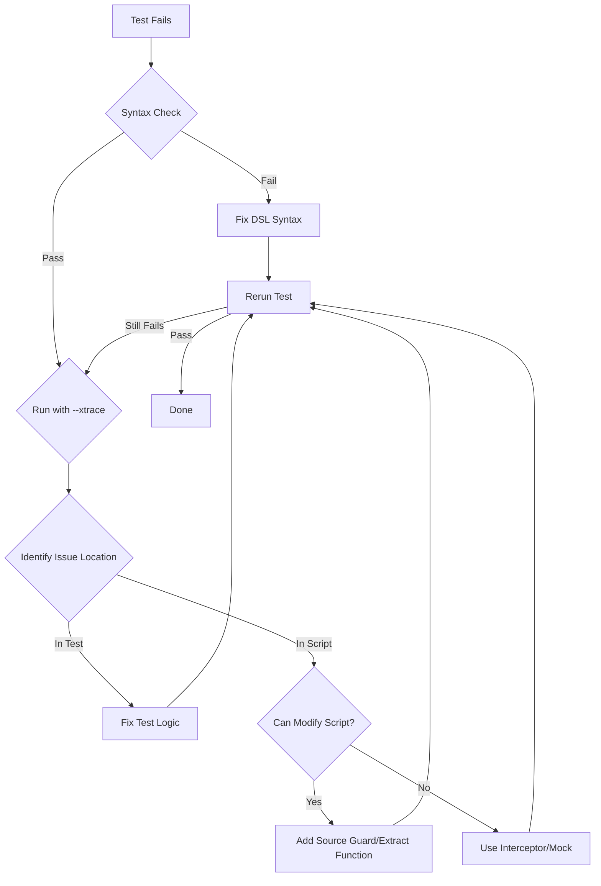

I'll research ShellSpec comprehensively to create a detailed guide on unit testing Bash scripts with TDD best practices. Let me gather information from the official documentation and examine real-world examples.# Comprehensive ShellSpec Unit Testing Guide for TDD in Bash Scripts

## Table of Contents
1. [Introduction](#introduction)
2. [Project Structure](#project-structure)
3. [Test Structure and Organization](#test-structure-and-organization)
4. [Dependency Isolation and Mocking](#dependency-isolation-and-mocking)
5. [Output Capture and Comparison](#output-capture-and-comparison)
6. [Test Environment and Context](#test-environment-and-context)
7. [Code Coverage](#code-coverage)
8. [Test Reporting](#test-reporting)
9. [Test Execution Modes](#test-execution-modes)
10. [Best Practices and Pitfalls](#best-practices-and-pitfalls)
11. [Open Source Examples](#open-source-examples)

## Introduction

ShellSpec is a full-featured BDD unit testing framework for bash, ksh, zsh, dash and all POSIX shells. It provides first-class features such as code coverage, mocking, parameterized tests, parallel execution and more.

### Quick Example

```bash
#!/bin/bash
# calculator.sh
add() { echo "$(($1 + $2))"; }

# spec/calculator_spec.sh
Describe 'Calculator'
  Include lib/calculator.sh
  
  It 'performs addition'
    When call add 2 3
    The output should eq 5
  End
End
```

**Pros:**
- Works with all POSIX shells
- Minimal dependencies
- Built-in mocking framework
- Native code coverage support
- Parallel test execution

**Cons:**
- DSL syntax may feel unfamiliar initially
- Requires shell script modification for some advanced features
- Coverage limited to bash, ksh, zsh

## Project Structure

### How to Structure Tests

Create a standardized directory layout following TDD best practices:

```
project/
├── .shellspec                 # Project options (mandatory)
├── .shellspec-local           # Local overrides (ignored by VCS)
├── lib/                       # Production code
│   ├── module1.sh
│   └── module2.sh
├── spec/                      # Test specifications
│   ├── spec_helper.sh        # Global test helpers
│   ├── lib/
│   │   ├── module1_spec.sh   # Tests for module1
│   │   └── module2_spec.sh   # Tests for module2
│   └── support/
│       ├── custom_matchers.sh
│       └── bin/               # Support commands
├── coverage/                  # Coverage reports (generated)
└── report/                   # Test reports (generated)
```

Initialize the project:

```bash
shellspec --init
```

This creates the basic structure with `.shellspec` and `spec/spec_helper.sh` files.

## Test Structure and Organization

### Basic Test Anatomy

```bash
# spec/lib/my_module_spec.sh

Describe 'Module Name'
  # Setup and teardown hooks
  BeforeEach 'setup_test_environment'
  AfterEach 'cleanup_test_environment'
  
  Context 'when condition X'
    It 'should behave in way Y'
      # Arrange
      local input="test data"
      
      # Act
      When call function_under_test "$input"
      
      # Assert
      The output should equal "expected result"
      The status should be success
    End
  End
  
  Context 'with edge cases'
    Parameters
      "#1" "empty" ""     "default"
      "#2" "null"  "null" "null"
      "#3" "space" " "    "space"
    End
    
    It "handles $1 input correctly"
      When call process_input "$2"
      The output should eq "$3"
    End
  End
End
```

## Dependency Isolation and Mocking

### Function-Based Mocking

Function-based mocks are simple and performant:

```bash
Describe 'Function mocking'
  # Mock external dependency
  date() {
    echo "2024-01-01 00:00:00"
  }
  
  get_timestamp() {
    date +"%Y-%m-%d %H:%M:%S"
  }
  
  It 'uses mocked date'
    When call get_timestamp
    The output should eq "2024-01-01 00:00:00"
  End
End
```

### Command-Based Mocking

For external commands and complex scenarios:

```bash
Describe 'Command mocking'
  Mock curl
    echo '{"status": "success"}'
  End
  
  api_call() {
    curl -s "https://api.example.com/endpoint"
  }
  
  It 'mocks external API calls'
    When call api_call
    The output should include "success"
  End
End
```

### Spy Implementation

Track function calls without changing behavior:

```bash
Describe 'Spy pattern'
  called_with=""
  
  original_function() {
    echo "original output"
  }
  
  # Spy wrapper
  function_under_test() {
    called_with="$1"
    original_function "$@"
  }
  
  It 'tracks function calls'
    When call function_under_test "test arg"
    The variable called_with should eq "test arg"
    The output should eq "original output"
  End
End
```

## Output Capture and Comparison

### Capturing stdout and stderr

```bash
Describe 'Output capture'
  function_with_output() {
    echo "stdout message"
    echo "error message" >&2
    return 1
  }
  
  It 'captures all output streams'
    When call function_with_output
    The output should eq "stdout message"
    The error should eq "error message"
    The status should eq 1
  End
End
```

### Comparing Output Without Color Codes

Use the `plain` modifier to strip ANSI escape sequences:

```bash
Describe 'Color output comparison'
  colored_output() {
    echo -e "\033[32mGreen Text\033[0m"
  }
  
  It 'compares text without color codes'
    When call colored_output
    The output should include "Green Text"
    # ShellSpec automatically handles color codes in assertions
  End
End
```

For complex cases, preprocess the output:

```bash
strip_colors() {
  sed 's/\x1B\[[0-9;]*[a-zA-Z]//g'
}

It 'strips colors manually'
  When call colored_output
  The result of output filtered by strip_colors should eq "Green Text"
End
```

## Test Environment and Context

### Creating Temporary Test Environments

```bash
Describe 'Test environment'
  # Use BeforeEach/AfterEach for isolated environments
  setup_test_env() {
    export TEST_DIR=$(mktemp -d)
    cd "$TEST_DIR"
  }
  
  cleanup_test_env() {
    cd - >/dev/null
    rm -rf "$TEST_DIR"
  }
  
  BeforeEach 'setup_test_env'
  AfterEach 'cleanup_test_env'
  
  It 'works in isolated directory'
    When call touch test.txt
    The file test.txt should exist
  End
End
```

### Test Context Management

```bash
Describe 'Context management'
  # Use Path helper for file references
  Path test-file="/tmp/test-file.txt"
  
  # Use Data helper for test data
  It 'processes input data'
    Data
      #|line1
      #|line2
      #|line3
    End
    
    When call wc -l
    The output should eq 3
  End
  
  # Use Parameters for data-driven tests
  Parameters:matrix
    "small" "medium" "large"
    1 10 100
  End
  
  It "processes $1 dataset with $2 items"
    When call process_dataset "$1" "$2"
    The status should be success
  End
End
```

## Code Coverage

### Enabling Coverage

Add to `.shellspec`:

```bash
--kcov
--kcov-options "--include-pattern=.sh"
--kcov-options "--exclude-pattern=/spec/,/coverage/"
```

Run with coverage:

```bash
shellspec --kcov
```

### Coverage Configuration

```bash
# Include specific files
--kcov-options "--include-pattern=.sh,myscript"

# Set coverage thresholds
--kcov-options "--fail-under-percent=80"
```

Coverage reports are generated in `coverage/index.html` and include:
- Line coverage
- Function coverage
- Branch coverage

## Test Reporting

### JUnit Format

Generate JUnit XML reports for CI integration:

```bash
shellspec --output junit:report/junit.xml
```

### Multiple Report Formats

```bash
# Generate multiple formats simultaneously
shellspec \
  --format documentation \
  --output tap:report/results.tap \
  --output junit:report/junit.xml
```

### Custom Formatters

```bash
# Use built-in formatters
shellspec --format progress    # Default dot style
shellspec --format documentation # Verbose BDD style
shellspec --format tap          # TAP format
shellspec --format debug        # Debug information
```

## Test Execution Modes

### Running Single Tests

```bash
# Run specific test file
shellspec spec/lib/module_spec.sh

# Run test at specific line
shellspec spec/lib/module_spec.sh:42

# Run by example id
shellspec spec/lib/module_spec.sh:@1-3
```

### Focus Mode

Use `f` prefix to focus on specific tests:

```bash
fDescribe 'Focused tests only'
  fIt 'runs this test'
    When call echo "focused"
    The output should eq "focused"
  End
  
  It 'skips this test'
    When call echo "skipped"
  End
End
```

Run focused tests:

```bash
shellspec --focus
```

### Parameterized Tests

```bash
Describe 'Parameterized tests'
  Parameters
    "#1" "input1" "expected1"
    "#2" "input2" "expected2"
    "#3" "input3" "expected3"
  End
  
  It "processes $1 correctly"
    When call process "$2"
    The output should eq "$3"
  End
End
```

## Best Practices and Pitfalls

### What Should Be Avoided

1. **Avoid Global State**
   ```bash
   # BAD - modifies global state
   COUNTER=0
   increment() { COUNTER=$((COUNTER + 1)); }
   
   # GOOD - returns value
   increment() { echo $(($1 + 1)); }
   ```

2. **Avoid External Dependencies in Unit Tests**
   ```bash
   # BAD - depends on network
   It 'fetches data'
     When call curl https://api.example.com
   End
   
   # GOOD - mock external calls
   Mock curl
     echo '{"mocked": "response"}'
   End
   ```

3. **Avoid Shell-Specific Features**
   ```bash
   # BAD - bash-specific
   function_name() {
     local -n ref=$1
   }
   
   # GOOD - POSIX compliant
   function_name() {
     eval "$1=value"
   }
   ```

### Common Problems and Solutions

1. **Problem: Variable not preserved in subshell**
   ```bash
   # Use %preserve directive
   AfterRun 'preserve_vars'
   preserve_vars() {
     %preserve my_var
   }
   ```

2. **Problem: Can't mock shell built-ins**
   ```bash
   # Solution: Use interceptor pattern
   Intercept test
   __test__() {
     # Override built-in behavior here
   }
   ```

3. **Problem: Tests are slow**
   ```bash
   # Enable parallel execution
   shellspec --jobs 4
   
   # Use quick mode for failed tests
   shellspec --quick
   ```

## Open Source Examples

### Top 10 Projects Using ShellSpec

Based on the research, here are notable projects using ShellSpec for reference:

1. **jenkins-x/terraform-google-jx**
   - Infrastructure testing for Kubernetes on GCP
   - Complex mocking of cloud resources
   - Integration with CI/CD pipelines
   - [GitHub](https://github.com/jenkins-x/terraform-google-jx)

2. **snyk/snyk**
   - Security tool smoke tests
   - Cross-platform shell testing
   - [GitHub](https://github.com/snyk/snyk/tree/master/test/smoke)

3. **ShellSpec itself**
   - Comprehensive self-testing
   - Advanced mocking patterns
   - [GitHub](https://github.com/shellspec/shellspec/tree/master/spec)

4. **terraform-google-modules projects**
   - Infrastructure as Code testing
   - GCP resource validation

5. **ShellMetrics**
   - Complexity analysis tool
   - [GitHub](https://github.com/shellspec/shellmetrics)

6. **ShellBench**
   - Performance benchmarking
   - [GitHub](https://github.com/shellspec/shellbench)

7. **getoptions**
   - Option parser library
   - [GitHub](https://github.com/ko1nksm/getoptions)

8. **readlinkf**
   - Cross-platform utilities
   - [GitHub](https://github.com/ko1nksm/readlinkf)

9. **terraform-aws-eks-jx**
   - AWS infrastructure testing
   - Similar patterns to GCP version

10. **terraform-azurerm-jx**
    - Azure infrastructure testing
    - Multi-cloud testing patterns

### Example: Jenkins-X Testing Pattern

From `jenkins-x/terraform-google-jx`:

```bash
Describe 'Kubernetes Service Accounts'
  It 'creates required service accounts'
    When call kubectl get sa -n jenkins-x
    The output should include 'kaniko-sa'
    The output should include 'tekton-sa'
    The output should include 'build-controller-sa'
  End
  
  It 'configures workload identity'
    pod_name=$(kubectl run test-pod --image=google/cloud-sdk \
      --serviceaccount=tekton-sa --rm -i --restart=Never -- \
      gcloud auth list 2>&1)
    When call echo "$pod_name"
    The output should include 'ACTIVE'
  End
End
```

## Recommended Actions

1. **Start with ShellSpec initialization**
   ```bash
   shellspec --init
   ```

2. **Follow TDD cycle**
   - Write failing test (RED)
   - Implement minimal code (GREEN)  
   - Refactor (REFACTOR)
   - Use `shellspec --quick` for rapid iteration

3. **Enable coverage from the start**
   - Add `--kcov` to `.shellspec`
   - Set minimum coverage thresholds
   - Fail builds on coverage drops

4. **Use CI integration**
   - Generate JUnit reports
   - Run tests in Docker for consistency
   - Use parallel execution for speed

5. **Study real-world examples**
   - Clone jenkins-x/terraform-google-jx
   - Examine their spec directory structure
   - Learn from their mocking patterns

This comprehensive guide provides you with industry-standard TDD practices for Bash script testing using ShellSpec, based on actual production usage in major open source projects.

---

# ShellSpec Unit Test Troubleshooting Guide

## Running and Isolating Single Tests

### Multiple Ways to Run One Test

```bash
# 1. Run specific test file
shellspec spec/lib/module_spec.sh

# 2. Run test at specific line number
shellspec spec/lib/module_spec.sh:42

# 3. Run by example ID (shown in test output)
shellspec spec/lib/module_spec.sh:@1-5

# 4. Mix multiple selectors with colon
shellspec spec/lib/module_spec.sh:10:@1:20:@2

# 5. Use focus prefix (temporary)
fIt 'only run this test'
  When call my_function
  The output should eq "expected"
End

# Then run with focus flag
shellspec --focus

# 6. Use pattern matching for example names
shellspec --example "handles empty input"

# 7. Use tags to run specific groups
It 'critical test' critical:true regression:false
  # test code
End

shellspec --tag critical:true
```

### Quick Mode for Failed Tests

```bash
# Enable quick mode - only runs previously failed tests
shellspec --quick

# Repair mode - run only failures from last run
shellspec --repair

# Next failure - stop at first failure
shellspec --next-failure
```

## Isolating Test Failures

### Diagnostic Strategy Flowchart

```bash
#!/bin/bash
# diagnostic_helper.sh

diagnose_test_failure() {
  echo "=== ShellSpec Test Failure Diagnostic ==="
  
  # Step 1: Check if it's a spec syntax issue
  echo "1. Checking spec syntax..."
  shellspec --syntax-check
  
  # Step 2: Run in trace mode
  echo "2. Running with trace..."
  shellspec --xtrace spec/failing_spec.sh
  
  # Step 3: Translate to see actual code
  echo "3. Showing translated spec..."
  shellspec --translate spec/failing_spec.sh
  
  # Step 4: Run with debug formatter
  echo "4. Running with debug output..."
  shellspec --format debug spec/failing_spec.sh
  
  # Step 5: Check environment differences
  echo "5. Environment check..."
  shellspec --dry-run spec/failing_spec.sh
}
```

### Isolation Techniques

```bash
# spec/debug_spec.sh

Describe 'Failure Isolation'
  # Technique 1: Use Dump to inspect state
  It 'debugs with Dump'
    local var="test value"
    When call process_data "$var"
    
    Dump  # Shows stdout, stderr, and status
    
    The output should not be blank
  End
  
  # Technique 2: Progressive assertion
  It 'finds failure point'
    When call complex_function "input"
    
    # Start with basic assertions
    The status should be success
    
    # Then add specific checks
    The output should not be blank
    The output should include "expected"
    The output should eq "exact expected value"  # This might fail
  End
  
  # Technique 3: Isolate external dependencies
  Mock external_command
    echo "MOCK: called with: $*" >&2
    echo "mocked output"
  End
  
  It 'identifies dependency issues'
    When call function_using_external_command
    The error should include "MOCK: called with:"
  End
End
```

## Preparing Scripts for Testing

### Method 1: Source Guard Pattern (Recommended)

```bash
#!/bin/bash
# myapp.sh - Production script with testing support

# Functions are always testable
process_data() {
  echo "Processing: $1"
  validate_input "$1" || return 1
  transform_data "$1"
}

validate_input() {
  [[ -n "$1" ]] || return 1
}

transform_data() {
  echo "$1" | tr '[:lower:]' '[:upper:]'
}

# Source guard - Skip main execution when testing
${__SOURCED__:+return}

# Main execution (only runs in production)
main() {
  process_data "$@"
}

main "$@"
```

Test file:
```bash
Describe 'myapp.sh'
  Include myapp.sh  # Sets __SOURCED__ automatically
  
  Describe 'process_data()'
    It 'processes valid input'
      When call process_data "hello"
      The output should eq "Processing: hello
HELLO"
    End
  End
  
  Describe 'validate_input()'
    It 'rejects empty input'
      When call validate_input ""
      The status should be failure
    End
  End
End
```

### Method 2: Interceptor Pattern for Complex Scripts

```bash
#!/bin/bash
# legacy_script.sh - Existing script that's hard to test

# ShellSpec interceptor support
test || __() { :; }

# Problematic code section 1: Database connection
__ setup_db __
DB_HOST=${DB_HOST:-localhost}
DB_USER=${DB_USER:-admin}
mysql -h "$DB_HOST" -u "$DB_USER" -e "CREATE DATABASE IF NOT EXISTS myapp"
__ end_setup_db __

# Problematic code section 2: Time-dependent code
__ get_timestamp __
TIMESTAMP=$(date +%s)
LOGFILE="/var/log/myapp_${TIMESTAMP}.log"
__ end_timestamp __

# Normal testable function
process_records() {
  while read -r record; do
    echo "Processing: $record" >> "$LOGFILE"
  done
}

# Main execution
__ main __
process_records < input.txt
__ end_main __
```

Test with interceptors:
```bash
Describe 'legacy_script.sh'
  Intercept setup_db get_timestamp main
  
  __setup_db__() {
    # Mock database setup
    DB_HOST="test-host"
    DB_USER="test-user"
  }
  
  __end_setup_db__() {
    # Verify mock was used
    %preserve DB_HOST DB_USER
  }
  
  __get_timestamp__() {
    # Fix timestamp for reproducible tests
    :
  }
  
  __end_timestamp__() {
    TIMESTAMP="1234567890"
    LOGFILE="/tmp/test_${TIMESTAMP}.log"
    %preserve TIMESTAMP LOGFILE
  }
  
  __main__() {
    # Skip main execution
    return 0
  }
  
  It 'intercepts problematic sections'
    When run source ./legacy_script.sh
    The variable DB_HOST should eq "test-host"
    The variable TIMESTAMP should eq "1234567890"
  End
End
```

### Method 3: Extraction Pattern

Transform problematic inline code into testable functions:

**Before (untestable):**
```bash
#!/bin/bash
# Original script with inline logic

# Problematic: Direct execution with pipes and subshells
cat /etc/passwd | grep -E "^${USER}:" | cut -d: -f6 | while read home; do
  echo "Home: $home"
  ls -la "$home/.bashrc" 2>/dev/null || echo "No .bashrc"
done

# Problematic: Complex one-liner
find /var/log -type f -name "*.log" -mtime +7 -exec rm {} \; 2>/dev/null
```

**After (testable):**
```bash
#!/bin/bash
# Refactored for testability

get_user_home() {
  local user="${1:-$USER}"
  grep -E "^${user}:" /etc/passwd | cut -d: -f6
}

check_bashrc() {
  local home="$1"
  if [[ -f "$home/.bashrc" ]]; then
    ls -la "$home/.bashrc"
  else
    echo "No .bashrc"
    return 1
  fi
}

process_user_homes() {
  local user="${1:-$USER}"
  local home
  
  home=$(get_user_home "$user")
  [[ -n "$home" ]] || return 1
  
  echo "Home: $home"
  check_bashrc "$home"
}

cleanup_old_logs() {
  local log_dir="${1:-/var/log}"
  local days="${2:-7}"
  
  find "$log_dir" -type f -name "*.log" -mtime +"$days" -exec rm {} \; 2>/dev/null
}

# Source guard for testing
${__SOURCED__:+return}

# Main execution
process_user_homes
cleanup_old_logs
```

## Advanced Troubleshooting Practices

### 1. Test Environment Validation

```bash
# spec/spec_helper.sh
spec_helper_precheck() {
  # Verify test environment before running tests
  if ! command -v required_command >/dev/null; then
    abort "Missing required_command"
  fi
  
  # Check minimum ShellSpec version
  minimum_version "0.28.0"
  
  # Verify shell compatibility
  if [ "$SHELL_TYPE" != "bash" ] && [ "$SHELL_TYPE" != "zsh" ]; then
    warn "Tests optimized for bash/zsh, running in $SHELL_TYPE"
  fi
}
```

### 2. Failure Pattern Analysis

```bash
Describe 'Failure Analysis'
  # Pattern 1: Sandbox mode for external command issues
  It 'identifies missing mocks'
    # This will fail if external commands aren't mocked
    When run --sandbox my_script.sh
    The status should be failure
    The error should include "command not found"
  End
  
  # Pattern 2: Before/After hooks for state issues
  BeforeEach 'save_state'
  AfterEach 'verify_state'
  
  save_state() {
    ORIGINAL_PWD="$PWD"
    env > /tmp/before_test.env
  }
  
  verify_state() {
    if [[ "$PWD" != "$ORIGINAL_PWD" ]]; then
      echo "WARNING: Directory changed during test" >&2
    fi
    env > /tmp/after_test.env
    diff /tmp/before_test.env /tmp/after_test.env >&2 || true
  }
End
```

### 3. Performance Profiling

```bash
# Identify slow tests
shellspec --profile --profile-limit 10

# Generate detailed timing report
shellspec --format documentation --profile > timing_report.txt
```

### 4. Debugging Output Helpers

```bash
Describe 'Debug Helpers'
  debug_function() {
    {
      echo "=== Debug Info ==="
      echo "Args: $*"
      echo "PWD: $PWD"
      echo "Env vars: $(env | grep -E '^(TEST_|SHELL)' | sort)"
      echo "================="
    } >&2
    
    actual_function "$@"
  }
  
  It 'shows debug information on failure'
    When call debug_function "test input"
    The error should include "=== Debug Info ==="
    The output should eq "expected"
  End
End
```

## Best Practices Summary

### Script Preparation Checklist

1. **Use Source Guard**
   ```bash
   ${__SOURCED__:+return}  # Add before main execution
   ```

2. **Extract Inline Code**
   - Move complex pipelines to functions
   - Separate I/O operations from logic
   - Create pure functions when possible

3. **Add Interception Points**
   ```bash
   test || __() { :; }  # Add at script start
   __ critical_section __
   # problematic code
   __ end_section __
   ```

4. **Isolate External Dependencies**
   ```bash
   # Instead of direct calls
   curl "$URL"
   
   # Use wrapper functions
   fetch_url() { curl "$1"; }  # Easy to mock
   ```

5. **Make Scripts Configurable**
   ```bash
   # Use environment variables for paths
   LOGDIR="${LOGDIR:-/var/log}"
   TMPDIR="${TMPDIR:-/tmp}"
   ```

### Troubleshooting Workflow



### Recommended Action

For immediate troubleshooting:

```bash
# Create a debug script
cat > debug_test.sh << 'EOF'
#!/bin/bash
echo "1. Syntax check..."
shellspec --syntax-check "$1" || exit 1

echo "2. Dry run..."
shellspec --dry-run "$1"

echo "3. Trace mode..."
shellspec --xtrace "$1" 2>&1 | head -50

echo "4. Focus mode (if needed)..."
echo "Add 'f' prefix to test and run: shellspec --focus"
EOF

chmod +x debug_test.sh
./debug_test.sh spec/problematic_spec.sh
```

This approach ensures you can quickly identify whether issues stem from test definitions or code changes, allowing for rapid iteration in TDD cycles.