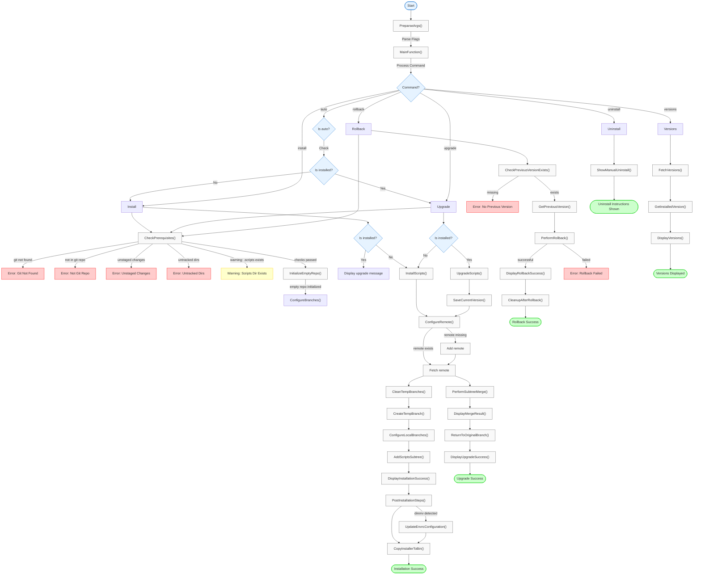

# e-Bash Installation Guide

This document provides detailed test scenarios for installing, upgrading, and managing the e-Bash script utility in your projects. Each scenario includes step-by-step instructions in Gherkin format (Given-When-Then) along with the exact commands to execute.

## Table of Contents

- [Positive Test Scenarios](#positive-test-scenarios)
  - [Scenario 1: Installing e-Bash in a new Git repository](#scenario-1-installing-e-bash-in-a-new-git-repository)
  - [Scenario 2: Installing e-Bash in an existing repository with content](#scenario-2-installing-e-bash-in-an-existing-repository-with-content)
  - [Scenario 3: Upgrading e-Bash in an existing installation](#scenario-3-upgrading-e-bash-in-an-existing-installation)
  - [Scenario 4: Rolling back e-Bash to a previous version](#scenario-4-rolling-back-e-bash-to-a-previous-version)
  - [Scenario 5: Viewing available versions of e-Bash](#scenario-5-viewing-available-versions-of-e-bash)
  - [Scenario 6: Installing a specific version of e-Bash](#scenario-6-installing-a-specific-version-of-e-bash)
  - [Scenario 7: Installing e-Bash in a repository with custom main branch name](#scenario-7-installing-e-bash-in-a-repository-with-custom-main-branch-name)
  - [Scenario 8: Uninstalling e-Bash from a repository](#scenario-8-uninstalling-e-bash-from-a-repository)
- [Negative Test Scenarios](#negative-test-scenarios)
  - [Scenario 9: Attempting to install in a non-git directory](#scenario-9-attempting-to-install-in-a-non-git-directory)
  - [Scenario 10: Attempting to rollback without a previous version](#scenario-10-attempting-to-rollback-without-a-previous-version)
  - [Scenario 11: Installing with an invalid version tag](#scenario-11-installing-with-an-invalid-version-tag)
  - [Scenario 12: Installation with insufficient permissions](#scenario-12-installation-with-insufficient-permissions)
  - [Scenario 13: Network failure during installation](#scenario-13-network-failure-during-installation)

## Environment Variables

The installation script supports environment variable overrides for advanced use cases such as:
- Installing from a forked or alternative repository
- Using a company-internal mirror of the e-bash repository
- Testing with a local git repository
- Continuous integration and automated testing

### Available Environment Variables

| Variable | Default Value | Description |
|----------|--------------|-------------|
| `E_BASH_REMOTE_NAME` | `e-bash` | Git remote name used for the e-bash repository |
| `E_BASH_REMOTE_MASTER` | `master` | Master branch name in the remote repository |
| `E_BASH_REMOTE_URL` | `https://github.com/OleksandrKucherenko/e-bash.git` | Git repository URL for cloning and fetching |
| `E_BASH_REMOTE_INSTALL_SH` | `https://raw.githubusercontent.com/OleksandrKucherenko/e-bash/master/bin/install.e-bash.sh` | URL to the installation script |
| `E_BASH_REMOTE_SHORT` | `https://git.new/e-bash` | Short URL for quick installation via curl |

### Usage Examples

#### Installing from a Fork

```bash
export E_BASH_REMOTE_URL="https://github.com/mycompany/e-bash.git"
export E_BASH_REMOTE_INSTALL_SH="https://raw.githubusercontent.com/mycompany/e-bash/master/bin/install.e-bash.sh"
curl -sSL "$E_BASH_REMOTE_INSTALL_SH" | bash -s -- install
```

#### Installing from a Local Repository (Testing)

```bash
export E_BASH_REMOTE_URL="/path/to/local/e-bash.git"
./bin/install.e-bash.sh install
```

#### Using with Different Branch Name

```bash
export E_BASH_REMOTE_MASTER="main"
export E_BASH_REMOTE_URL="https://github.com/mycompany/e-bash.git"
./bin/install.e-bash.sh install
```

## Using e-bash from Global Installation

When you install e-bash globally using `--global` flag, scripts are installed to `~/.e-bash/`. To use e-bash utilities in your own scripts that can run from anywhere, add this bootstrap snippet at the top of your script:

### Bootstrap Versions

**Version A: Documented/Readable** (with error handling)

```bash
# -----------------------------------------------------------------------------
# e-bash bootstrap: auto-establish E_BASH and PATH
# -----------------------------------------------------------------------------
[ -z "$E_BASH" ] && readonly E_BASH="$(
  # 1. Use existing E_BASH if set (from direnv, mise, etc.)
  # 2. Find .scripts relative to this script
  # 3. Fallback to ~/.e-bash/.scripts (global installation)
  if [ -n "${E_BASH+x}" ]; then
    echo "$E_BASH"
  elif [ -f "$(cd "$(dirname "${BASH_SOURCE[0]}")" && pwd)/../.scripts/_colors.sh" ]; then
    echo "$(cd "$(dirname "${BASH_SOURCE[0]}")" && cd ../.scripts && pwd)"
  elif [ -d "$HOME/.e-bash/.scripts" ]; then
    echo "$HOME/.e-bash/.scripts"
  else
    echo "" >&2
    echo "Error: Cannot find e-bash library. Please install e-bash first." >&2
    echo "  Visit: https://github.com/OleksandrKucherenko/e-bash" >&2
    echo "" >&2
    exit 1
  fi
)"

# Add gnubin to PATH (Linux/macOS compatibility)
if [[ -d "$E_BASH/../bin/gnubin" ]]; then
  PATH="$E_BASH/../bin/gnubin:$PATH"
  # Source _gnu.sh to create symlinks if needed
  [[ -f "$E_BASH/_gnu.sh" ]] && source "$E_BASH/_gnu.sh"
fi

# Now source required modules
source "$E_BASH/_colors.sh"
source "$E_BASH/_logger.sh"
# ... add more modules as needed
# -----------------------------------------------------------------------------
```

**Version B: Compact 2-LOC** (248 characters, good balance)

```bash
# 2-LOC bootstrap: E_BASH discovery + gnubin PATH
[ -z "$E_BASH" ] && readonly E_BASH="$(cd "$(dirname "${BASH_SOURCE[0]:-$0}")" && [[ -f ../.scripts/_colors.sh ]] && echo "$(pwd)/../.scripts" || echo "$HOME/.e-bash/.scripts")" && source "${E_BASH}/_gnu.sh" && PATH="${E_BASH}/../bin/gnubin:$PATH"
# Source modules (examples)
source "$E_BASH/_colors.sh"; source "$E_BASH/_logger.sh"
```

**Version C: Ultra-Optimized** (198 characters, used in e-bash scripts)

```bash
# Ultra-optimized bootstrap: E_BASH discovery + gnubin PATH
[ "$E_BASH" ] || { _src=${BASH_SOURCE:-$0}; E_BASH=$(cd "${_src%/*}/../.scripts" 2>&- && pwd || echo ~/.e-bash/.scripts); readonly E_BASH; . "$E_BASH/_gnu.sh"; PATH="$E_BASH/../bin/gnubin:$PATH"; }
# Source modules (examples)
source "$E_BASH/_colors.sh"; source "$E_BASH/_logger.sh"
```

### Discovery Order

All bootstrap versions use this priority order to find `E_BASH`:

1. **`E_BASH` environment variable** - If already set by direnv, mise, or manually
2. **Relative path** - Find `.scripts/` relative to script location (`../.scripts`)
3. **Global fallback** - Use `~/.e-bash/.scripts` if it exists
4. **Error** - Print helpful error with installation link if nothing found (Version A only)

### Example: Creating a Standalone Script

```bash
#!/usr/bin/env bash
# My script that uses e-bash utilities

# Bootstrap e-bash
[ -z "$E_BASH" ] && readonly E_BASH="$([ -n "${E_BASH+x}" ] && echo "$E_BASH" || [ -f "$(cd "$(dirname "${BASH_SOURCE[0]}")" && pwd)/../.scripts/_colors.sh" ] && echo "$(cd "$(dirname "${BASH_SOURCE[0]}")" && cd ../.scripts && pwd)" || [ -d "$HOME/.e-bash/.scripts" ] && echo "$HOME/.e-bash/.scripts" || { echo "Error: Cannot find e-bash library" >&2; exit 1; })"
if [[ -d "$E_BASH/../bin/gnubin" ]]; then
  PATH="$E_BASH/../bin/gnubin:$PATH"
  [[ -f "$E_BASH/_gnu.sh" ]] && source "$E_BASH/_gnu.sh"
fi

# Source required modules
source "$E_BASH/_logger.sh"
source "$E_BASH/_commons.sh"

logger myscript "$@"

# Your script logic here...
echo:MyScript "Hello from my script!"
```

## Review of the Script Actions

The following state diagram illustrates the logic flow of the `install.e-bash.sh` script, showing the various states and transitions during the installation, upgrade, and rollback processes.




## Passing results

- [x] Scenario 1: Installing e-Bash in a new Git repository
  - [x] Fresh installation in a new repository
  - [x] `.scripts` directory exists
  - [x] Main branch detected correctly
  - [x] README.md file created with e-bash install/update instructions
  - [x] `git remote -v` shows `e-bash` remote
  - [x] `git branch -v | tee` shows `e-bash-scripts` and `e-bash-temp` branches
  - [x] `git status` shows no untracked files
  - [x] `git tag -l | tee` shows tags fetched from `e-bash` remote
  - [x] `versions` command marks correct branch/tag as `[CURRENT]`
- [x] Scenario 2: Installing e-Bash in an existing repository with content
- [x] Scenario 3: Upgrading e-Bash in an existing installation
- [x] Scenario 4: Rolling back e-Bash to a previous version
- [x] Scenario 5: Viewing available versions of e-Bash
- [x] Scenario 6: Installing a specific version of e-Bash
- [x] Scenario 7: Installing e-Bash in a repository with custom main branch name
- [ ] Scenario 8: Uninstalling e-Bash from a repository
- [x] Scenario 9: Attempting to install in a non-git directory
- [x] Scenario 10: Attempting to rollback without a previous version
- [x] Scenario 11: Installing with an invalid version tag
- [ ] Scenario 12: Installation with insufficient permissions
- [ ] Scenario 13: Network failure during installation

## Commands Snippets

```bash
# delete empty git repo files after tests, to make it ready for next test
rm -rf .git .scripts README.md bin .e-bash-previous-version

# create and commit empty bin folder
mkdir -p bin && touch bin/.gitkeep && git add bin && git commit -m "bin folder"
```


## Positive Test Scenarios

### Scenario 1: Installing e-Bash in a new Git repository

**Feature**: e-Bash Installation in a New Repository
- As a developer
- I want to install e-bash in a new repository
- So that I can use e-bash utilities in my project

**Scenario**: Fresh installation in a new repository
- Given I have a new git repository
- When I run the installation script
- Then e-bash should be installed successfully
- And the `.scripts` directory should exist
- And the main branch should be detected correctly

**Commands to execute**:

```bash
mkdir -p /tmp && cd /tmp && git init
curl -fsSL https://raw.githubusercontent.com/OleksandrKucherenko/e-bash/master/bin/install.e-bash.sh | bash -s --
```

### Scenario 2: Installing e-Bash in an existing repository with content

**Feature**: e-Bash Installation in Existing Repository
- As a developer
- I want to install e-bash in my existing project
- So that I can use e-bash utilities in my existing codebase

**Scenario**: Installation in existing repository with content
- Given I have an existing git repository with some content
- When I run the installation script
- Then e-bash should be installed successfully
- And my existing code should remain intact
- And the `.scripts` directory should exist

**Commands to execute**:

```bash
mkdir -p /tmp/e-bash-test/existing-repo && cd /tmp/e-bash-test/existing-repo
git init
echo "# My Project" > README.md
mkdir -p src
echo "console.log('Hello World');" > src/index.js
git add .
git commit -m "Initial commit"
curl -fsSL https://raw.githubusercontent.com/OleksandrKucherenko/e-bash/master/bin/install.e-bash.sh | bash -s --
```

### Scenario 3: Upgrading e-Bash in an existing installation

**Feature**: e-Bash Upgrade
- As a developer
- I want to upgrade my e-bash installation to the latest version
- So that I can use the newest features and fixes

**Scenario**: Upgrading existing e-bash installation
- Given I have e-bash installed in my repository
- When I run the upgrade command
- Then e-bash should be upgraded to the latest version
- And I should see the version change in the output

**Commands to execute**:

```bash
# First install e-bash
mkdir -p /tmp/e-bash-test/upgrade-repo && cd /tmp/e-bash-test/upgrade-repo
git init
curl -fsSL https://raw.githubusercontent.com/OleksandrKucherenko/e-bash/master/bin/install.e-bash.sh | bash -s -- upgrade
```

### Scenario 4: Rolling back e-Bash to a previous version

**Feature**: e-Bash Rollback
- As a developer
- I want to rollback to a previous version of e-bash
- So that I can revert if the latest version has issues

**Scenario**: Rolling back to previous version
- Given I have upgraded e-bash in my repository
- When I run the rollback command
- Then e-bash should be rolled back to the previous version
- And I should see the version change in the output

**Commands to execute**:

```bash
# First install and upgrade e-bash
mkdir -p /tmp/e-bash-test/rollback-repo && cd /tmp/e-bash-test/rollback-repo
git init

# install 
curl -fsSL https://raw.githubusercontent.com/OleksandrKucherenko/e-bash/master/bin/install.e-bash.sh | bash -s -- install v1.0.0

# upgrade to latest
./bin/install.e-bash.sh upgrade

# Then rollback to v1.0.0
./bin/install.e-bash.sh rollback
```

### Scenario 5: Viewing available versions of e-Bash

**Feature**: e-Bash Version Management
- As a developer
- I want to see all available versions of e-bash
- So that I can choose which version to install

**Scenario**: Listing available versions
- Given I have e-bash installed in my repository
- When I run the versions command
- Then I should see a list of all available versions
- And the current installed version should be marked

**Commands to execute**:

```bash
curl -fsSL https://raw.githubusercontent.com/OleksandrKucherenko/e-bash/master/bin/install.e-bash.sh | bash -s -- versions

# Or local script if it installed:
./bin/install.e-bash.sh versions
```

### Scenario 6: Installing a specific version of e-Bash

**Feature**: e-Bash Specific Version Installation
- As a developer
- I want to install a specific version of e-bash
- So that I can use a version that I know works for my project

**Scenario**: Installing specific version
- Given I have a git repository
- When I run the installation script with a specific version
- Then that specific version of e-bash should be installed
- And I should see the correct version in the output

**Commands to execute**:

```bash
mkdir -p /tmp/e-bash-test/specific-version-repo && cd /tmp/e-bash-test/specific-version-repo
git init

# Replace v1.0.0 with an actual tag that exists in the repository
curl -fsSL https://raw.githubusercontent.com/OleksandrKucherenko/e-bash/master/bin/install.e-bash.sh | bash -s -- install v1.0.0
```

### Scenario 7: Installing e-Bash in a repository with custom main branch name

**Feature**: e-Bash with Custom Branch Names
- As a developer
- I want to install e-bash in a repository with a custom main branch name
- So that it works correctly regardless of my git branch naming convention

**Scenario**: Installation with custom main branch
- Given I have a git repository with a custom main branch name
- When I run the installation script
- Then e-bash should be installed successfully
- And the custom main branch should be detected correctly

**Commands to execute**:

```bash
mkdir -p /tmp/e-bash-test/custom-branch-repo && cd /tmp/e-bash-test/custom-branch-repo
git init
git checkout -b main-custom
echo "# Custom Branch Repo" > README.md
git add .
git commit -m "Initial commit"

# Install e-bash
curl -fsSL https://raw.githubusercontent.com/OleksandrKucherenko/e-bash/master/bin/install.e-bash.sh | bash -s -- install
```

### Scenario 8: Uninstalling e-Bash from a repository

**Feature**: e-Bash Uninstallation
- As a developer
- I want to uninstall e-bash from my repository
- So that I can clean up if I no longer need it

**Scenario**: Uninstalling e-bash
- Given I have e-bash installed in my repository
- When I remove the .e-bash directory and related files
- Then e-bash should be completely uninstalled from my project

**Commands to execute**:

```bash
# First install e-bash
mkdir -p /tmp/e-bash-test/uninstall-repo && cd /tmp/e-bash-test/uninstall-repo
git init
curl -fsSL https://raw.githubusercontent.com/OleksandrKucherenko/e-bash/master/bin/install.e-bash.sh | bash -s -- install

# Then uninstall it
rm -rf .scripts
rm -f bin/install.e-bash.sh

# Optional: Remove from .envrc if it exists
if [ -f .envrc ]; then sed -i '/e-bash/d' .envrc; fi
```

## Negative Test Scenarios

### Scenario 9: Attempting to install in a non-git directory

**Feature**: e-Bash Installation Error Handling
- As a developer
- I want to see proper error messages when installing in invalid environments
- So that I can understand and fix the issue

**Scenario**: Installation in a non-git directory
- Given I have a directory that is not a git repository
- When I run the installation script
- Then I should see an appropriate error message
- And the script should exit with a non-zero status

**Commands to execute**:

```bash
mkdir -p /tmp/e-bash-test/non-git-dir && cd /tmp/e-bash-test/non-git-dir
# Run without git init
curl -fsSL https://raw.githubusercontent.com/OleksandrKucherenko/e-bash/master/bin/install.e-bash.sh | bash
# Check exit code
echo $?
```

### Scenario 10: Attempting to rollback without a previous version

**Feature**: e-Bash Rollback Error Handling
- As a developer
- I want to see proper error messages when rollback is not possible
- So that I can understand the limitation

**Scenario**: Rollback without previous version
- Given I have a fresh installation of e-bash
- When I run the rollback command without any previous versions
- Then I should see an appropriate error message
- And the script should not make any changes

**Commands to execute**:

```bash
mkdir -p /tmp/e-bash-test/invalid-rollback && cd /tmp/e-bash-test/invalid-rollback
git init
curl -fsSL https://raw.githubusercontent.com/OleksandrKucherenko/e-bash/master/bin/install.e-bash.sh | bash
# Attempt rollback with no previous version
./bin/install.e-bash.sh rollback
```

### Scenario 11: Installing with an invalid version tag

**Feature**: e-Bash Invalid Version Handling
- As a developer
- I want to see proper error messages when specifying invalid versions
- So that I can correct my input

**Scenario**: Installation with non-existent version tag
- Given I have a git repository
- When I run the installation script with a non-existent version tag
- Then I should see an appropriate error message
- And the script should exit with a non-zero status

**Commands to execute**:

```bash
mkdir -p /tmp/e-bash-test/invalid-version && cd /tmp/e-bash-test/invalid-version
git init
# Try with a non-existent version tag
curl -fsSL https://raw.githubusercontent.com/OleksandrKucherenko/e-bash/master/bin/install.e-bash.sh | bash -s -- non-existent-tag
# Check exit code
echo $?
```

### Scenario 12: Installation with insufficient permissions

**Feature**: e-Bash Permission Error Handling
- As a developer
- I want to see proper error messages when there are permission issues
- So that I can fix the permissions

**Scenario**: Installation in a read-only directory
- Given I have a git repository in a read-only directory
- When I run the installation script
- Then I should see an appropriate error message about permissions
- And the script should exit with a non-zero status

**Commands to execute**:

```bash
mkdir -p /tmp/e-bash-test/permission-test && cd /tmp/e-bash-test/permission-test
git init
# Make the directory read-only
chmod -w .
# Try to install
curl -fsSL https://raw.githubusercontent.com/OleksandrKucherenko/e-bash/master/bin/install.e-bash.sh | bash
# Check exit code
echo $?
# Restore permissions for cleanup
chmod +w .
```

### Scenario 13: Network failure during installation

**Feature**: e-Bash Network Error Handling
- As a developer
- I want to see proper error messages when network issues occur
- So that I can diagnose and resolve connectivity problems

**Scenario**: Installation with simulated network failure
- Given I have a git repository
- When I run the installation script with a simulated network outage
- Then I should see an appropriate error message
- And the script should exit with a non-zero status

**Commands to execute**:

```bash
mkdir -p /tmp/e-bash-test/network-test && cd /tmp/e-bash-test/network-test
git init
# Simulate network issue by using an invalid domain
# Replace the actual URL with an invalid one
sed 's|github.com/OleksandrKucherenko/e-bash|nonexistent-domain.invalid/repo|g' < /path/to/install.e-bash.sh | bash
# Check exit code
echo $?
```

## Manual Testing Instructions

```bash
# goto workspace
cd ~/workspace

# make a temporary git repo
mkdir tmp && cd tmp && git init

# make an alias for the install script
ln -s ~/workspace/e-bash/bin/install.e-bash.sh install.e-bash.sh

# verify the current state with global HOME involved
./install.e-bash.sh versions

# redefine HOME to a temporary directory
HOME=$(pwd) ./install.e-bash.sh versions

# try DRY run installation first
HOME=$(pwd) ./install.e-bash.sh install --global --dry-run

# update global installation (or install if no installed yet)
HOME=$(pwd) ./install.e-bash.sh update --global
```